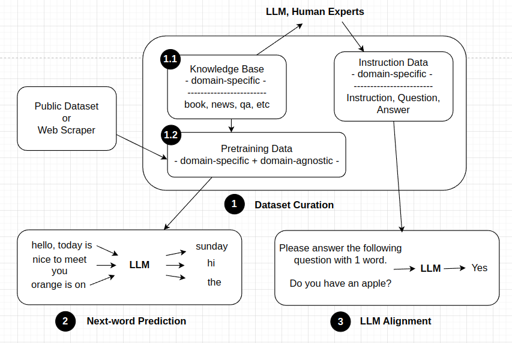

# LLM Cookbook
Large language models (LLMs) have revolutionized the way we interact with AI. Unlike previous NLP models, LLMs are multi-tasking and capable of performing a wide range of tasks, from sentiment analysis to question answering. In future, we may need a single model to handle all daily tasks, such as writing emails, answering questions, and even driving cars.

However, most existing open-source LLMs are built for chatbot instead of domain-specific applications. Thus, we have to retrain them from the scratch for application needs.

In this repository, we provide a set of recipes to help you quickly build your own domain-specfic LLM, ranging from data preparation, pre-train, supervised fine-tuning, serving and LLM agents.

> Why we need to pretrain LLMs instead of fine-tuning?
> Domain knowledge is a basic understanding of text and it is hard to obtain from fine-tuning (e.g., abbreviation). In fine-tuning stage, LLM only learns how to response like human and does not update common knowledge.

## Table of contents
- [LLM Cookbook](#llm-cookbook)
    - [Overview](#overview)
    - [Codebase Selection](#codebase-selection)
    - [Data Preparation](#data-preparation)
    - [Learn domain knowledge via pretrain](#learn-domain-knowledge-via-pretrain)
    - [Align LLMs behaviours with instruction tuning](#align-llms-behaviours-with-instruction-tuning)
    - [Efficiently Serving LLMs](#efficiently-serving-llms)
    - [Make LLMs agent for your applications](#make-llms-agent-for-your-applications)

## Overview
> For Chinese readers, please refer to this [tutorial](https://cloud.tencent.com/developer/article/2315386).



## Codebase Selection
Although a lot of LLMs are released, we only focus on open-source codebases which contain pre-train and fine-tuning scripts.
- [litgpt](https://github.com/Lightning-AI/litgpt)   **highly recommended!**
    - well-structured documentation and support most English LLMs.
- [alignment-handbook](https://github.com/huggingface/alignment-handbook) 
    - well-structured documentation and support Zephyr series.
- [Llama-Chinese](https://github.com/LlamaFamily/Llama-Chinese)  , [Chinese-LLaMA-Alpaca](https://github.com/ymcui/Chinese-LLaMA-Alpaca)  , [Chinese-LLaMA-Alpaca-3](https://github.com/ymcui/Chinese-LLaMA-Alpaca-3)  
    - well-structured documentation and support Llama series (chinese).

- [CPM-Bee](https://github.com/OpenBMB/CPM-Bee)  
    - well-structured documentation and support CPM-Bee series (chinese).
- [TigerBot](https://github.com/TigerResearch/TigerBot)  
    - well-structured documentation and support tiggerbot-7b/13b/70b (chinese, from llama series).
- [MedicalGPT](https://github.com/shibing624/MedicalGPT)   **highly recommended!**
    - well-structured docuementation and support diverse Chinese LLMs 
- [wisdomInterrogatory](https://github.com/zhihaiLLM/wisdomInterrogatory)  
    - detailed instructions on dataset construction.

## Data Preparation

Knowledge based construction refer to [wisdomInterrogatory](https://github.com/zhihaiLLM/wisdomInterrogatory). Diversity is a key for pre-training.

- Pretrain / Continual Pretrain (~1M): domain-specific data (30%-40%) + opensource data (60%-70%).
- Supervised Fine-tuning (~50K): domain-specific (100%).
- Reinforcement Learning (RLHF) (~50K): domain-specific (100%).

> _Note: domain-specific data of the 2nd and 3rd stages are instruction data which consists of task description, question and answer. It is created by human experts or LLM itself. If you want to build instructuon data with GPT4, please refer to [Self-Instruct](https://github.com/yizhongw/self-instruct)._


_image source: [Self-Instruct](https://github.com/yizhongw/self-instruct)_

## Learn domain knowledge via pretrain

Pretrain aims to learn common knowledge and trains LLM in a next-word prediction task.

## Align LLMs behaviours with instruction tuning

Instruction tuning (also called supervised finetuning) targets to make LLMs output in a expected format. The training data is often like this: 
```markdown
Below is an instruction that describes a task, paired with an input that provides further context. 
Write a response that appropriately completes the request.

### Instruction:
{instruction}

### Input:
{input}

### Response: 
```

## Efficiently Serving LLMs 
Serving LLMs efficiently employs a lot of popular techniques, such as quantization, KV cache management, and distributed inference. Fortunately, most open-source serving frameworks have supported them. Usually, we choose [vLLM](https://docs.vllm.ai/en/latest/index.html) for throughput-sensitive scenarios and [TensorRT-LLM](https://github.com/NVIDIA/TensorRT-LLM) for latency-sensitive scenarios.

## Make LLMs agent for your applications
A single LLM only acts as a chatbot and answers user questions. To make LLM userful, we need to teach LLM use tools and external knowledge.


*image source: [Agents and tools](https://huggingface.co/docs/transformers/agents)*

### Tutorials
1. [Agent and tools](https://huggingface.co/docs/transformers/agents), HuggingFace
2. [Advanced RAG on Hugging Face documentation using LangChain](https://huggingface.co/learn/cookbook/advanced_rag), HuggingFace
3. [Build an agent with tool-calling superpowers 🦸 using Transformers Agents](https://huggingface.co/learn/cookbook/agents), HuggingFace
4. [Agentic RAG: turbocharge your RAG with query reformulation and self-query! 🚀](https://huggingface.co/learn/cookbook/agent_rag), HuggingFace

### Practice
1. [Build an agent with LangChain](https://python.langchain.com/v0.1/docs/modules/agents/), LangChain
2. [Berkeley Function Calling Leaderboard](https://github.com/ShishirPatil/gorilla/tree/main/berkeley-function-call-leaderboard), UC Berkeley