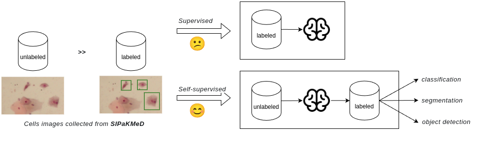

# Self-Supervised Learning

Self-supervised learning (SSL) is a type of unsupervised learning that aims to learn a general representation of data without the need for labeled examples. **It is particularly useful in scenarios where labeled data is scarce or expensive to obtain.** SSL leverages the inherent structure of the data itself to create supervisory signals, allowing the model to learn useful features and representations.

How does self-supervised learning outperform supervised learning when labeled data is scarce?

Training effective models on high-dimensional, unstructured data with limited labels presents a significant challenge in learning a robust data representation. Ideally, a model should transform raw data into **_a lower-dimensional, more structured, and semantically meaningful space_**. This enriched representation then allows for successful training of downstream tasks even with a small amount of labeled data.

Existing libraries for self-supervised learning include:
- [LightlySSL](https://github.com/lightly-ai/lightly): A python library for self-supervised learning on images.
- [MMPretrain](https://github.com/open-mmlab/mmpretrain): A python library for self-supervised learning and multi-modal pretraining.

Main challenges

Milestone works

Best practices